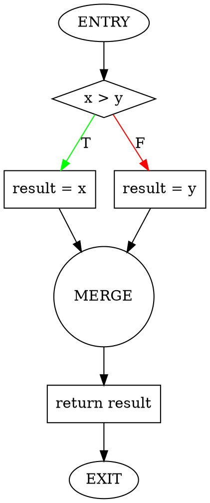

# Control Flow Abstraction Generator

Generate abstract Control Flow Graph representations of programs.

## Overview

This skill analyzes program code and generates Control Flow Graphs (CFGs) that abstract the program's control flow structure. CFGs show how execution flows through the program via nodes (statements, conditions) and edges (control transfers), making them suitable for static analysis, formal verification, and program understanding.

## How to Use

Provide:
1. **Program code**: Function or program to analyze
2. **Analysis scope**: Function-level or program-level
3. **Output format** (optional): Textual, DOT, JSON, or multiple

The skill will generate:
- CFG with nodes and edges
- Node types (entry, exit, statement, condition, merge)
- Edge types (sequential, true/false branches, back edges, calls)
- Optional: DOT format for visualization, JSON for tool integration

## CFG Generation Workflow

### Step 1: Parse Program Structure

Identify program constructs:
- **Sequential statements**: Assignments, expressions, declarations
- **Conditional statements**: if-then-else, switch-case
- **Loop statements**: while, for, do-while
- **Function calls**: Direct calls, recursive calls
- **Control transfers**: break, continue, return, goto
- **Exception handling**: try-catch-finally

### Step 2: Create CFG Nodes

Generate nodes for each construct:

**Entry Node**: Function/program start
- Label: `ENTRY` or function name
- Type: `entry`
- Successors: First statement

**Exit Node**: Function/program end
- Label: `EXIT` or `return`
- Type: `exit`
- Predecessors: All return points

**Statement Node**: Regular statement
- Label: Statement text or line number
- Type: `statement`
- Represents: Assignment, call, expression

**Condition Node**: Branch decision
- Label: Boolean expression
- Type: `condition`
- Successors: True branch, false branch

**Merge Node**: Branch join point
- Label: `MERGE` or empty
- Type: `merge`
- Predecessors: Multiple branches

### Step 3: Create CFG Edges

Connect nodes with appropriate edges:

**Sequential Edge**: Normal flow
- From: Statement/node
- To: Next statement/node
- Label: None or `→`

**True Edge**: Condition true branch
- From: Condition node
- To: True branch first statement
- Label: `T` or `true`

**False Edge**: Condition false branch
- From: Condition node
- To: False branch first statement
- Label: `F` or `false`

**Back Edge**: Loop iteration
- From: Loop body end
- To: Loop header
- Label: `↶` or `back`

**Call Edge**: Function invocation (interprocedural)
- From: Call site
- To: Called function entry
- Label: `⇒` or `call`

**Return Edge**: Function return (interprocedural)
- From: Called function exit
- To: Call site return point
- Label: `⇐` or `return`

### Step 4: Handle Special Constructs

**Loops**: Create back edges from body to header

**Break**: Create edge from break statement to loop exit

**Continue**: Create back edge from continue to loop header

**Return**: Create edge from return to EXIT node

**Exceptions**: Create exception edges from try block to catch handlers

### Step 5: Generate Output

Produce CFG in requested format(s):
- Textual representation
- DOT format for Graphviz
- JSON for tool integration

## Example: Simple Conditional

**Code**:
```python
def max_value(x, y):
    if x > y:
        result = x
    else:
        result = y
    return result
```

**CFG (Textual)**:
```
Node 1 (ENTRY):
  Label: max_value
  Successors: [2]

Node 2 (x > y):
  Type: condition
  Predecessors: [1]
  Successors: [3 (true), 4 (false)]

Node 3 (result = x):
  Type: statement
  Predecessors: [2]
  Successors: [5]

Node 4 (result = y):
  Type: statement
  Predecessors: [2]
  Successors: [5]

Node 5 (MERGE):
  Type: merge
  Predecessors: [3, 4]
  Successors: [6]

Node 6 (return result):
  Type: statement
  Predecessors: [5]
  Successors: [7]

Node 7 (EXIT):
  Predecessors: [6]
```

**CFG (Visual)**:
```
    ENTRY
      ↓
   [x > y]
    ↓   ↓
   T↓   ↓F
    ↓   ↓
[result=x] [result=y]
    ↓       ↓
    └→MERGE←┘
        ↓
  [return result]
        ↓
      EXIT
```

**CFG (DOT)**:


## Example: While Loop

**Code**:
```python
def sum_to_n(n):
    sum = 0
    i = 0
    while i < n:
        sum += i
        i += 1
    return sum
```

**CFG (Visual)**:
```
    ENTRY
      ↓
   [sum = 0]
      ↓
   [i = 0]
      ↓
      ┌─────────┐
      ↓         ↑
   [i < n]      ↑ (back edge)
    ↓   ↓       ↑
   T↓   ↓F      ↑
    ↓   ↓       ↑
[sum += i]      ↑
      ↓         ↑
  [i += 1]──────┘
      ↓F
[return sum]
      ↓
    EXIT
```

**Key Features**:
- Loop header: `[i < n]`
- Back edge: From `[i += 1]` to `[i < n]`
- Exit edge: False branch from condition to return

**CFG (Textual)**:
```
Node 1 (ENTRY)
  → Node 2

Node 2 (sum = 0)
  → Node 3

Node 3 (i = 0)
  → Node 4

Node 4 (i < n) [LOOP HEADER]
  →T Node 5
  →F Node 7

Node 5 (sum += i)
  → Node 6

Node 6 (i += 1)
  → Node 4 [BACK EDGE]

Node 7 (return sum)
  → Node 8

Node 8 (EXIT)
```

## Example: Nested Control Flow

**Code**:
```python
def process(arr, threshold):
    result = []
    for item in arr:
        if item > threshold:
            result.append(item * 2)
        else:
            if item < 0:
                continue
            result.append(item)
    return result
```

**CFG (Visual)**:
```
ENTRY
  ↓
[result = []]
  ↓
[i = 0]
  ↓
  ┌──────────────────────┐
  ↓                      ↑
[i < len(arr)]           ↑
  ↓T                     ↑
[item = arr[i]]          ↑
  ↓                      ↑
[item > threshold]       ↑
  ↓T            ↓F       ↑
[result.append  [item<0] ↑
 (item*2)]        ↓T     ↑
  ↓               └──────┘ (continue)
  ↓              ↓F
  ↓         [result.append(item)]
  ↓               ↓
  └──→MERGE←──────┘
       ↓
   [i += 1]───────┘
       ↓F
  [return result]
       ↓
     EXIT
```

**Key Features**:
- Outer loop: for loop over array
- Inner conditional: if-else with nested if
- Continue statement: back edge to loop header
- Multiple merge points

## Example: Function Calls (Interprocedural)

**Code**:
```python
def factorial(n):
    if n <= 1:
        return 1
    return n * factorial(n-1)

def compute(x):
    result = factorial(x)
    return result + 1
```

**Intraprocedural CFG** (factorial only):
```
factorial:ENTRY
      ↓
   [n <= 1]
    ↓     ↓
   T↓     ↓F
    ↓     ↓
[return 1] [call factorial(n-1)]
    ↓           ↓
    ↓      [return n * result]
    ↓           ↓
    └──→EXIT←───┘
```

**Interprocedural CFG** (with call edges):
```
compute:ENTRY
      ↓
[call factorial(x)] ⇒ factorial:ENTRY
      ↓                     ↓
      ↓                [n <= 1]
      ↓                  ↓   ↓
      ↓                 ...  ...
      ↓                     ↓
[result = ...] ⇐ factorial:EXIT
      ↓
[return result + 1]
      ↓
compute:EXIT
```

**Key Features**:
- Call edge: From call site to callee entry
- Return edge: From callee exit to call site
- Recursive call: Edge back to same function

## Output Formats

### Textual Format

Human-readable node and edge listing:
```
Node <id> (<label>):
  Type: <type>
  Predecessors: [<ids>]
  Successors: [<ids>]
```

### DOT Format (Graphviz)

Graph visualization format:
```dot
digraph CFG {
  node [shape=box];
  n1 [label="...", shape=...];
  n1 -> n2 [label="...", color=...];
}
```

Generate PNG/SVG with: `dot -Tpng cfg.dot -o cfg.png`

### JSON Format

Machine-readable for tool integration:
```json
{
  "nodes": [
    {"id": 1, "label": "...", "type": "..."}
  ],
  "edges": [
    {"from": 1, "to": 2, "type": "..."}
  ]
}
```

## Analysis Levels

### Function-Level (Intraprocedural)

**Scope**: Single function
**Nodes**: Statements within function
**Edges**: Control flow within function
**Calls**: Treated as single statement nodes

**Use cases**:
- Function-level analysis
- Loop detection
- Path analysis within function

### Program-Level (Interprocedural)

**Scope**: Multiple functions
**Nodes**: Statements across all functions
**Edges**: Control flow + call/return edges
**Calls**: Explicit call and return edges

**Use cases**:
- Whole-program analysis
- Call graph construction
- Interprocedural dataflow

## CFG Properties

### Dominance

Node A dominates node B if every path from ENTRY to B passes through A.

**Uses**: Loop header identification, optimization

### Post-Dominance

Node A post-dominates node B if every path from B to EXIT passes through A.

**Uses**: Control dependence, merge point identification

### Reachability

Node B is reachable from node A if there exists a path from A to B.

**Uses**: Dead code detection, path analysis

### Strongly Connected Components

Maximal set of nodes where every node is reachable from every other.

**Uses**: Loop detection, cycle analysis

## Common Patterns

### Sequential Statements
**Pattern**: Linear flow
**See**: [cfg_patterns.md](references/cfg_patterns.md#sequential-statements)

### If-Then-Else
**Pattern**: Diamond shape with merge
**See**: [cfg_patterns.md](references/cfg_patterns.md#conditional-statements)

### While Loop
**Pattern**: Back edge from body to header
**See**: [cfg_patterns.md](references/cfg_patterns.md#loop-statements)

### Break/Continue
**Pattern**: Direct edges to exit/header
**See**: [cfg_patterns.md](references/cfg_patterns.md#loop-statements)

### Try-Catch
**Pattern**: Exception edges to handlers
**See**: [cfg_patterns.md](references/cfg_patterns.md#exception-handling)

## References

Detailed CFG construction patterns:

- **[cfg_patterns.md](references/cfg_patterns.md)**: Comprehensive patterns for all control flow constructs with examples

Load this reference when:
- Need detailed patterns for specific constructs
- Working with complex nested structures
- Want to see all output format examples
- Need CFG property definitions

## Tips

1. **Start with entry/exit**: Always create ENTRY and EXIT nodes first
2. **Handle loops carefully**: Identify loop headers and create back edges
3. **Merge branches**: Create explicit merge nodes after conditionals
4. **Label edges clearly**: Use T/F for branches, mark back edges
5. **Consider scope**: Choose function-level or program-level based on use case
6. **Visualize complex CFGs**: Use DOT format for large graphs
7. **Validate structure**: Check that all nodes are reachable from ENTRY
8. **Document assumptions**: Note how you handle language-specific constructs
