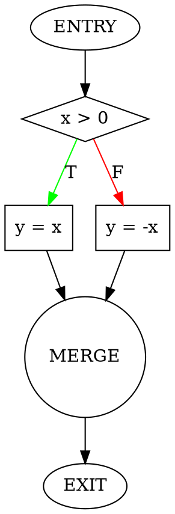

# Control Flow Graph Construction Patterns

Patterns for constructing CFGs from different program constructs.

## Table of Contents
- [CFG Basics](#cfg-basics)
- [Sequential Statements](#sequential-statements)
- [Conditional Statements](#conditional-statements)
- [Loop Statements](#loop-statements)
- [Function Calls](#function-calls)
- [Exception Handling](#exception-handling)

## CFG Basics

### Node Types

**Entry Node**: Starting point of execution
- Label: `ENTRY`
- Predecessors: None
- Successors: First statement

**Exit Node**: End point of execution
- Label: `EXIT`
- Predecessors: All return/end points
- Successors: None

**Statement Node**: Regular statement execution
- Label: Statement text or line number
- Predecessors: Previous statements
- Successors: Next statements

**Condition Node**: Branch decision point
- Label: Boolean expression
- Predecessors: Previous statements
- Successors: True branch, False branch

**Merge Node**: Join point after branches
- Label: `MERGE` or empty
- Predecessors: Multiple branches
- Successors: Next statement

### Edge Types

**Sequential Edge**: Normal flow from one statement to next
- Notation: `→` or solid line
- Condition: None

**True Edge**: Taken when condition is true
- Notation: `→T` or green line
- Condition: Condition evaluates to true

**False Edge**: Taken when condition is false
- Notation: `→F` or red line
- Condition: Condition evaluates to false

**Back Edge**: Loop iteration edge
- Notation: `↶` or dashed line
- Condition: Loop continues

**Call Edge**: Function invocation
- Notation: `⇒` or dotted line
- Condition: Function call

**Return Edge**: Function return
- Notation: `⇐` or dotted line
- Condition: Function returns

## Sequential Statements

### Pattern: Simple Sequence

**Code**:
```python
x = 1
y = 2
z = x + y
```

**CFG**:
```
ENTRY
  ↓
[x = 1]
  ↓
[y = 2]
  ↓
[z = x + y]
  ↓
EXIT
```

**Nodes**: 5 (ENTRY, 3 statements, EXIT)
**Edges**: 4 (all sequential)

### Pattern: Assignment Chain

**Code**:
```python
a = b + c
d = a * 2
e = d - 1
return e
```

**CFG**:
```
ENTRY
  ↓
[a = b + c]
  ↓
[d = a * 2]
  ↓
[e = d - 1]
  ↓
[return e]
  ↓
EXIT
```

## Conditional Statements

### Pattern: If-Then

**Code**:
```python
if x > 0:
    y = x
```

**CFG**:
```
ENTRY
  ↓
[x > 0]
  ↓T    ↓F
[y = x] MERGE
  ↓      ↑
  └──────┘
     ↓
   EXIT
```

**Nodes**: 5 (ENTRY, condition, statement, MERGE, EXIT)
**Edges**: 5 (1 to condition, 2 from condition, 1 to merge, 1 to exit)

### Pattern: If-Then-Else

**Code**:
```python
if x > 0:
    y = x
else:
    y = -x
```

**CFG**:
```
ENTRY
  ↓
[x > 0]
  ↓T        ↓F
[y = x]  [y = -x]
  ↓         ↓
  └─→MERGE←─┘
       ↓
     EXIT
```

**Nodes**: 6 (ENTRY, condition, 2 branches, MERGE, EXIT)
**Edges**: 6 (1 to condition, 2 from condition, 2 to merge, 1 to exit)

### Pattern: Nested If

**Code**:
```python
if x > 0:
    if y > 0:
        z = x + y
    else:
        z = x - y
```

**CFG**:
```
ENTRY
  ↓
[x > 0]
  ↓T           ↓F
[y > 0]      MERGE2
  ↓T    ↓F      ↑
[z=x+y][z=x-y]  ↑
  ↓      ↓      ↑
  └→MERGE1←─────┘
       ↓
    MERGE2
       ↓
     EXIT
```

### Pattern: If-Elif-Else Chain

**Code**:
```python
if x > 0:
    y = 1
elif x < 0:
    y = -1
else:
    y = 0
```

**CFG**:
```
ENTRY
  ↓
[x > 0]
  ↓T        ↓F
[y = 1]  [x < 0]
  ↓        ↓T      ↓F
  ↓      [y = -1] [y = 0]
  ↓        ↓        ↓
  └──→MERGE←────────┘
         ↓
       EXIT
```

## Loop Statements

### Pattern: While Loop

**Code**:
```python
while x > 0:
    x = x - 1
```

**CFG**:
```
ENTRY
  ↓
  ┌────────┐
  ↓        ↑
[x > 0]    ↑ (back edge)
  ↓T       ↑
[x = x - 1]┘
  ↓F
EXIT
```

**Key features**:
- Loop header: `[x > 0]`
- Back edge: From loop body to header
- Exit edge: False branch from condition

### Pattern: For Loop

**Code**:
```python
for i in range(n):
    sum += i
```

**CFG**:
```
ENTRY
  ↓
[i = 0]
  ↓
  ┌──────────┐
  ↓          ↑
[i < n]      ↑
  ↓T         ↑
[sum += i]   ↑
  ↓          ↑
[i = i + 1]──┘
  ↓F
EXIT
```

**Desugared form**: For loop converted to while loop

### Pattern: Do-While Loop

**Code**:
```c
do {
    x = x - 1;
} while (x > 0);
```

**CFG**:
```
ENTRY
  ↓
  ┌────────┐
  ↓        ↑
[x = x - 1]↑
  ↓        ↑
[x > 0]────┘
  ↓T (back edge)
  ↓F
EXIT
```

**Key difference**: Body executes before condition check

### Pattern: Nested Loops

**Code**:
```python
while i < n:
    while j < m:
        sum += 1
        j += 1
    i += 1
```

**CFG**:
```
ENTRY
  ↓
  ┌──────────────┐
  ↓              ↑
[i < n]          ↑
  ↓T             ↑
  ┌────────┐     ↑
  ↓        ↑     ↑
[j < m]    ↑     ↑
  ↓T       ↑     ↑
[sum += 1] ↑     ↑
  ↓        ↑     ↑
[j += 1]───┘     ↑
  ↓F             ↑
[i += 1]─────────┘
  ↓F
EXIT
```

### Pattern: Loop with Break

**Code**:
```python
while True:
    if x == 0:
        break
    x -= 1
```

**CFG**:
```
ENTRY
  ↓
  ┌────────┐
  ↓        ↑
[True]     ↑
  ↓        ↑
[x == 0]   ↑
  ↓T       ↑F
  ↓      [x -= 1]
  ↓        ↑
  ↓        └──┘
  ↓
EXIT
```

**Key feature**: Break creates edge directly to exit

### Pattern: Loop with Continue

**Code**:
```python
while x > 0:
    if x % 2 == 0:
        continue
    print(x)
    x -= 1
```

**CFG**:
```
ENTRY
  ↓
  ┌──────────────┐
  ↓              ↑
[x > 0]          ↑
  ↓T             ↑
[x % 2 == 0]     ↑
  ↓T             ↑
  └──────────────┘ (continue)
  ↓F
[print(x)]
  ↓
[x -= 1]─────────┘
  ↓F
EXIT
```

**Key feature**: Continue creates back edge to loop header

## Function Calls

### Pattern: Simple Function Call

**Code**:
```python
def foo():
    x = 1
    y = bar()
    return x + y
```

**Intraprocedural CFG** (single function):
```
ENTRY
  ↓
[x = 1]
  ↓
[y = bar()]
  ↓
[return x + y]
  ↓
EXIT
```

**Interprocedural CFG** (with call edges):
```
foo:ENTRY
  ↓
[x = 1]
  ↓
[call bar] ⇒ bar:ENTRY
  ↓            ↓
  ↓         bar:body
  ↓            ↓
[y = result] ⇐ bar:EXIT
  ↓
[return x + y]
  ↓
foo:EXIT
```

### Pattern: Conditional Function Call

**Code**:
```python
if x > 0:
    result = foo(x)
else:
    result = bar(x)
```

**CFG**:
```
ENTRY
  ↓
[x > 0]
  ↓T              ↓F
[call foo(x)]  [call bar(x)]
  ↓               ↓
[result = ...]  [result = ...]
  ↓               ↓
  └────→MERGE←────┘
          ↓
        EXIT
```

### Pattern: Recursive Function

**Code**:
```python
def factorial(n):
    if n <= 1:
        return 1
    return n * factorial(n-1)
```

**CFG**:
```
ENTRY
  ↓
[n <= 1]
  ↓T           ↓F
[return 1]  [call factorial(n-1)]
  ↓            ↓
  ↓         [return n * result]
  ↓            ↓
  └──→EXIT←────┘
```

**Key feature**: Recursive call edge back to ENTRY

## Exception Handling

### Pattern: Try-Catch

**Code**:
```python
try:
    x = risky_operation()
    y = x + 1
except Exception:
    y = 0
```

**CFG**:
```
ENTRY
  ↓
[x = risky_operation()]
  ↓normal    ↓exception
[y = x + 1]  [y = 0]
  ↓            ↓
  └──→MERGE←───┘
        ↓
      EXIT
```

**Key feature**: Exception edge from any statement in try block

### Pattern: Try-Finally

**Code**:
```python
try:
    x = operation()
finally:
    cleanup()
```

**CFG**:
```
ENTRY
  ↓
[x = operation()]
  ↓normal    ↓exception
  ↓            ↓
  └──→[cleanup()]←──┘
         ↓
       EXIT
```

**Key feature**: Finally block has edges from both normal and exception paths

## CFG Properties

### Dominance

**Definition**: Node A dominates node B if every path from ENTRY to B passes through A

**Example**:
```
ENTRY dominates all nodes
Loop header dominates loop body
Condition dominates both branches
```

### Post-Dominance

**Definition**: Node A post-dominates node B if every path from B to EXIT passes through A

**Example**:
```
EXIT post-dominates all nodes
Merge point post-dominates both branches
```

### Reachability

**Definition**: Node B is reachable from node A if there exists a path from A to B

**Uses**:
- Dead code detection (unreachable nodes)
- Path analysis
- Dataflow analysis

### Strongly Connected Components

**Definition**: Maximal set of nodes where every node is reachable from every other node

**Uses**:
- Loop detection
- Cycle analysis
- Reducibility checking

## CFG Formats

### Textual Format

```
Node 1 (ENTRY):
  Successors: [2]

Node 2 (x > 0):
  Predecessors: [1]
  Successors: [3 (true), 4 (false)]

Node 3 (y = x):
  Predecessors: [2]
  Successors: [5]

Node 4 (y = -x):
  Predecessors: [2]
  Successors: [5]

Node 5 (MERGE):
  Predecessors: [3, 4]
  Successors: [6]

Node 6 (EXIT):
  Predecessors: [5]
```

### DOT Format (Graphviz)



### JSON Format

```json
{
  "nodes": [
    {"id": 1, "label": "ENTRY", "type": "entry"},
    {"id": 2, "label": "x > 0", "type": "condition"},
    {"id": 3, "label": "y = x", "type": "statement"},
    {"id": 4, "label": "y = -x", "type": "statement"},
    {"id": 5, "label": "MERGE", "type": "merge"},
    {"id": 6, "label": "EXIT", "type": "exit"}
  ],
  "edges": [
    {"from": 1, "to": 2, "type": "sequential"},
    {"from": 2, "to": 3, "type": "true"},
    {"from": 2, "to": 4, "type": "false"},
    {"from": 3, "to": 5, "type": "sequential"},
    {"from": 4, "to": 5, "type": "sequential"},
    {"from": 5, "to": 6, "type": "sequential"}
  ]
}
```
